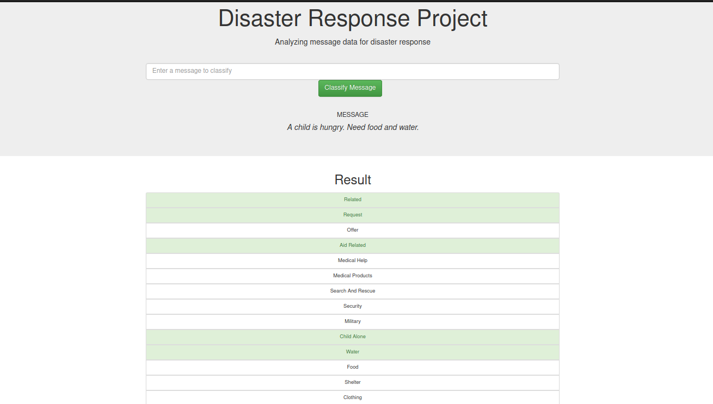
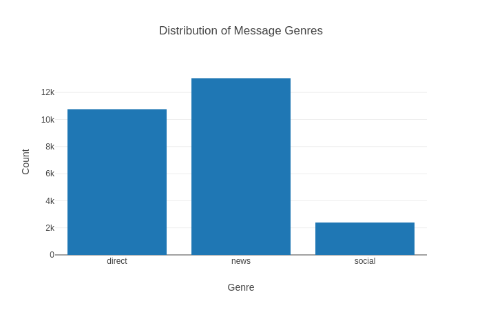
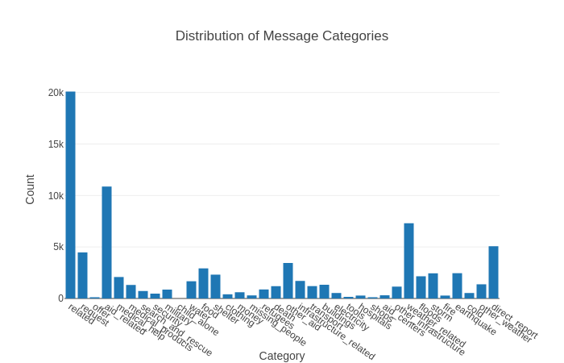
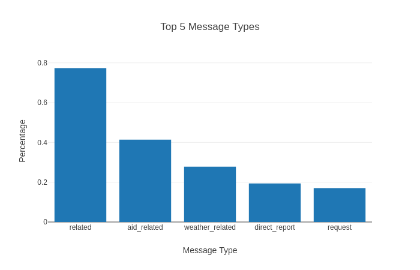

# Disaster Response Pipeline Project (Udacity - Data Science Nanodegree)


## Motivation

This project classifies messages recieved during disasters. This is developed as part of nanodegree program for Udacity. The data is provided by Figure Eight. 

The project is outlined below:

1. Data Pipeline : A SQLlite Database is built from historical disaster messages and their categories
2. Machine Learning Pipeline : A pipeline for NLP and building a model that classifies messages recieved into different categories
3. Web App : A web app which can classify a disaster message. The page also shows information about the historical data collected. 

### Dependencies
* Python 3.5+
* Machine Learning Libraries: NumPy, SciPy, Pandas, Sciki-Learn
* Natural Language Process Libraries: NLTK
* SQLlite Database Libraries: SQLalchemy
* Model Loading and Saving Library: Pickle
* Web App and Data Visualization: Flask, Plotly

### Installing
To clone the git repository:
```
git clone https://github.com/hchhatpar-home/disaster_response_pipeline.git
```
### Executing Program:
1. Wrangle data and save the cleaned data set to SQLlite DB:

        `python data/process_data.py data/disaster_messages.csv data/disaster_categories.csv data/disaster_response_db.db`

2. Load the data from DB, train classifier and save the model:

        `python models/train_classifier.py data/disaster_response_db.db models/message_classifier.pkl`

3. Run the following command in the app's directory to run your web app:

        `python run.py`

4. Go to http://0.0.0.0:3001/

## Screenshots

1. This is an example of classification for input message highlighted in green.




2. Some insights from historical data set used for training.








